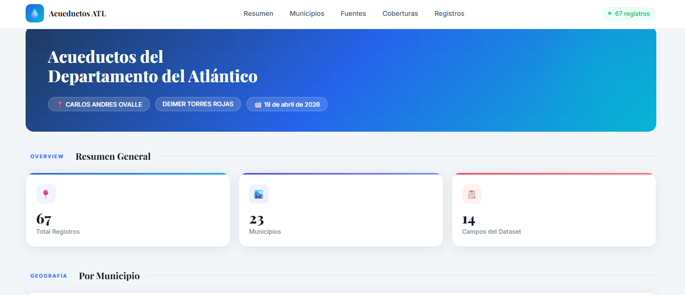
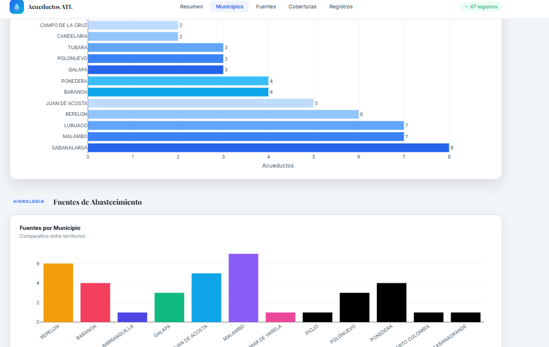
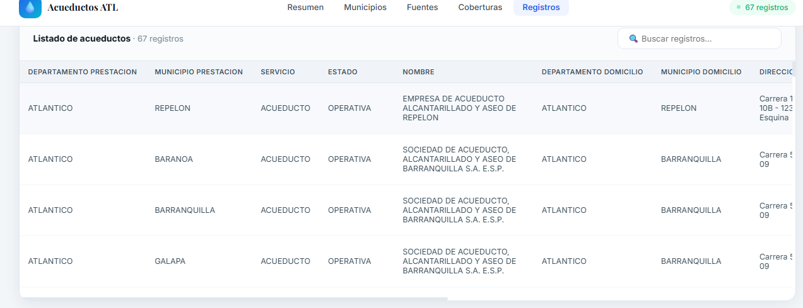

# 💧 Acueductos del Atlántico - API SODA

Este proyecto consiste en una página web que consume datos en tiempo real desde el portal de datos abiertos de Colombia, utilizando la API SODA.

El objetivo es visualizar información sobre los acueductos del departamento del Atlántico de forma clara, organizada e interactiva.

---

## 🚀 Tecnologías utilizadas

* HTML5
* CSS3 (diseño moderno y responsivo)
* JavaScript
* Plotly.js (gráficas interactivas)
* Fetch API

---

## 🌐 API utilizada

Se utilizó la API del portal de datos abiertos de Colombia:

👉 https://www.datos.gov.co/resource/uvff-29et.json

Esta API funciona bajo el estándar **SODA (Socrata Open Data API)** y permite consultar datos públicos en formato JSON mediante solicitudes HTTP.

---

## 📊 Funcionalidades principales

* Consumo de datos en tiempo real
* Dashboard interactivo
* Indicadores (KPIs)
* Gráficas dinámicas por municipio
* Visualización de tipos de acueducto
* Tabla con buscador
* Manejo de errores

---

## 🧠 ¿Cómo funciona?

1. Se realiza una solicitud a la API usando `fetch()`
2. Se obtienen los datos en formato JSON
3. Los datos se procesan automáticamente
4. Se visualizan en:

   * Tarjetas (resumen de datos)
   * Gráficas (Plotly)
   * Tabla interactiva

---

## 📁 Estructura del proyecto

```id="3lqgco"
📦 acueductos-atlantico
 ┣ 📄 index.html
 ┗ 📄 README.md
```

---

## 📸 Evidencia del funcionamiento

### 🔹 Dashboard principal

Visualización general de los datos.



---

### 🔹 Gráficas

Representación visual de los datos por municipio y categorías.



---

### 🔹 Tabla de datos

Listado completo con opción de búsqueda.



---

## ⚠️ Manejo de errores

El sistema incluye control de errores en caso de:

* Fallo en la conexión con la API
* Problemas en la carga de datos

Mostrando mensajes claros al usuario.

---

## 👨‍💻 Autores

* Deimer Torres Rojas
* Carlos Andrés Ovalle

---

## 📌 Conclusión

Este proyecto permite analizar datos abiertos de Colombia mediante una interfaz interactiva, facilitando la comprensión de la información y demostrando el uso práctico de APIs SODA en el desarrollo web.

